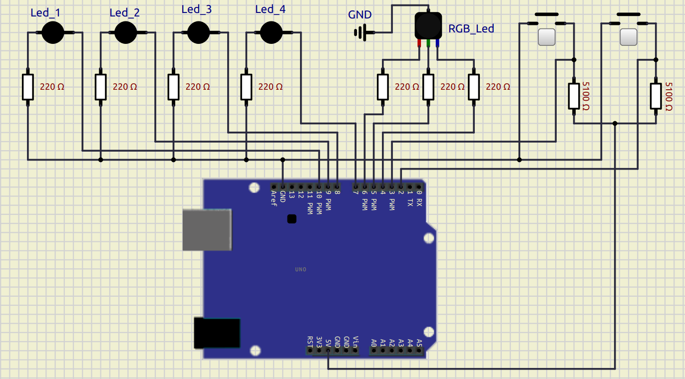

# EV Charger
This project uses an ATMega328P microcontroller (with the Arduino Framework) to emulate a charging station for electric vehicles. It also uses LEDs and buttons to make the expereince more interactive.

## Table of contents
- [Overview](#overview)
- [Hardware Setup](#hardware-setup)
- [Installation](#installation)
- [Code Overview](#code-overview)
- [Usage](#usage)


## Overview
The charging station has 2 main functionalities:
    1. Start the charging process with BTN1. The visual feedback of this processs is shown by the four blue LEDs.
    2. Forcefully stop the charging process using BTN2.
    Note: The green color of the RGB LED shows that the charging station is available for use and the red color shows that it's currently charging.

## Hardware Setup
### Components
- Arduino UNO board
- x2 push buttons (BTN1, BTN2)
- x4 blue LEDs - for charge process simulation (LED1-4)
- x1 RGB LED - red/green color shows station availability (RED_PIN, GREEN_PIN)
- x6 220Ω resistors (for LEDs) - optionally + 1 220Ω resistor for the blue pin in the RGB LED.
- x2 1K resistors (for buttons)
- Jumper wires

### Connections
- BTN1 (Pin 3)
- BTN2 (Pin 2)
- LED1 to LED4 (Pins 7 to 10)
- GREEN_PIN (Pin 5)
- RED_PIN (Pin 6)

### Project schematic

## Installation

## Code Overview
```
void BTN2pressed()
```
Checks if BTN2 was pressed for a second using debouncing and interrupts the charging state.
```
void syncBlink()
```
If charging is complete, makes all the LEDs blink synchronously for 3 times.
```
void charge()
```
Starts the charging process when BTN1 is pressed and checks is BTN2 was pressed.
## Usage
1. After connecting the serial cable to your PC and Arduino board, wait for the RGB LED to turn green.
2. Press BTN1 to begin the charging process and the blue LEDs will start blinking, while the RGB LED turns red.
3. While charging, you can stop the process by pressing BTN2 for 1-3 seconds. Alternatively, you can wait for the charging to end by itself.

